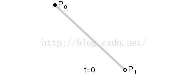
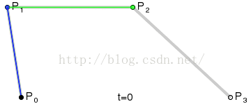
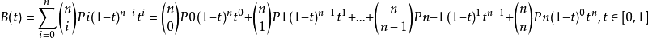

测试实现贝塞尔曲线的表现

### 贝塞尔曲线方程推导过程

> n 个点控制对应着 n - 1 阶贝塞尔曲线，并且可以通过**递归**的方式来绘制

#### 一阶曲线：

上图中间的点的位置计算公式如下，很简单的向量运算
$$
B_1(t) = P_0 + (P_1 - P_0)t
$$
换算一下
$$
B_1(t) = (1 - t)P_0 + tP1, t
$$

#### 二阶曲线

$$
P_0' = (1 - t)P0 + tP_1\\
P_1' = (1 - t)P1 + tP_2\\
B_2(t) = (1 - t)P_0' + tP_1'
$$
整理一下得到公式：
$$
B_2(t) = (1 - t)^2P_0 + 2t(1 - t)P_1 + t^2P_2
$$

#### 三阶曲线

公式推导略

#### 高阶曲线公式

